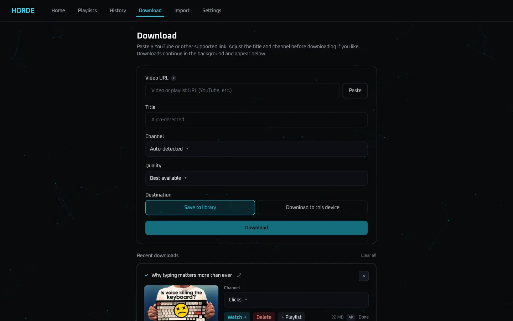
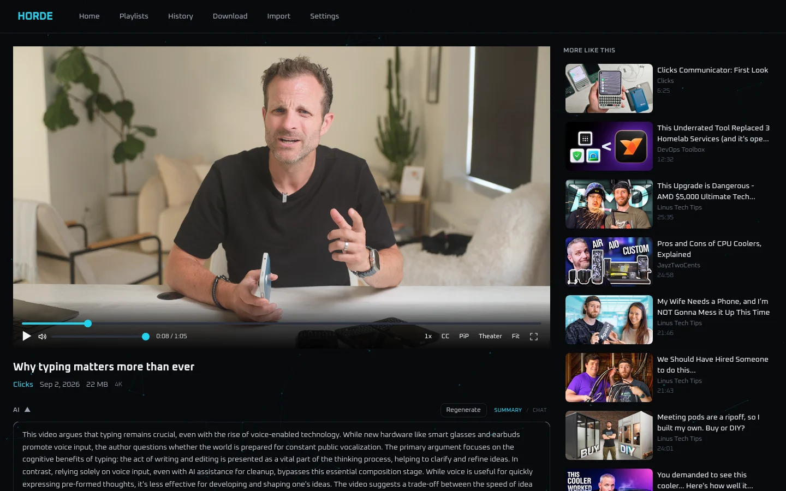

# Horde

This entire project was vibecoded ~~in a relatively short amount of time~~. I've used Plex for a long time, but I really don't like how it handles "Other" videos that aren't Movies and TV. There are lots of YouTube and other videos that I want to archive and "horde" (hoard) but still be able to find and watch them in an organized way. I looked a bit at TubeArchivist and it looks decent, but I wanted to make something exactly the way I envisioned it, and since I had a lot of credit left for the month on my Cursor subscription I figured I'd let it rip. Horde gives a clean frontend to browse and search your videos on your server, and it also has a GUI for yt-dlp to download videos directly from any supported website (though I haven't tested much outside of YouTube). You can also drop in any video file from your computer, upload it directly to Horde's storage directory, and adjust metadata in the Horde UI.

I also made some AI features like auto tagging, video summary and chat, and enhanced search. This can be used with Ollama or an OpenRouter API key. If you want to use Ollama you'll need some kind of GPU on your host machine. I have a 1660 Super but use OpenRouter anyway because it's lower maintenance, faster, and it costs virtually nothing for this app.

There is also the ability to stream videos directly from YouTube, though it is somewhat fragile and quality can vary from video to video. It's mostly functional, but streaming is not the primary focus of Horde. The idea is more that you can stream the video to preview, then choose to download or not. 

I don't take credit for creating this, it was all Opus 4.8, Composer 2.5, and recently, Grok 4.5 and 4.6. I built it specifically for my use case, TrueNAS with Dockge. There may or may not be updates in the future, depending on how much I end up using this day to day. Try it out, and if you want to change anything then I welcome you to download the repo, boot it up with your AI-enabled IDE of choice, and get vibecoding. If you have any questions the best way to handle it is to open this repo in Cursor and use the Ask mode (that's what I do). Hope you enjoy.

--

FastAPI serves a built React UI (and an in-app MkDocs wiki) from one container.
Compose always starts a [bgutil POT](https://github.com/Brainicism/bgutil-ytdlp-pot-provider)
sidecar for YouTube; Ollama is an optional profile. Built for TrueNAS / Dockge,
works on any Docker host.

**No authentication.** Single-admin, trusted LAN only. Do not port-forward it.

Full docs ship in the image: **Settings → System → Documentation**, or `/wiki/`
on the host. Interactive API docs: `/docs`.

## Features

- **Downloads** — paste a yt-dlp URL, pick a quality preset, watch a FIFO queue
  with live progress, pause/resume, and YouTube playlist import.
- **On disk** — `Channel/Year/Title [id].ext` so SMB browsing matches the UI.
- **Import** — drag-and-drop upload or drop `.mp4` / `.mkv` / `.webm` into the
  media folder; a review queue before they join the library.
- **Library** — channel sidebar, YouTube channel catalogs (browse / preview /
  download undownloaded uploads), hybrid search, tags, bulk select, continue
  watching.
- **Player** — standard / theater / windowed, mini player, PiP, Chromecast,
  SponsorBlock, chapters, subtitles. Optional YouTube stream preview (fragile;
  no transcoding — the browser plays the original file).
- **Playlists** — your own lists or imported YouTube playlists.
- **AI** (optional) — Ollama and/or OpenRouter for embeddings, tags, summaries,
  chat, recommendations, and duplicate help.

## Screenshots






## Quick start

There is no pre-built Docker Hub image. Clone this repo onto the Docker host,
set two paths in `.env`, and Compose **builds** the image. Use a real
`git clone` (not a GitHub ZIP) so later `update.sh` can `git pull`.

Do this on the **host** (SSH / TrueNAS shell) — not Dockge’s per-service
**Bash** button, which is inside a container.

### Clone

Any Docker host:

```bash
git clone https://github.com/jm-connell/horde.git
cd horde
```

**TrueNAS / Dockge:** clone *into* `DOCKGE_STACKS_DIR` so the folder name is
the stack name. The host path and the path *inside the Dockge container* must
match (default `/opt/stacks`; on TrueNAS prefer a pool dataset). Do not
**Add Stack** and paste only `docker-compose.yml` — `build: .` needs the
whole repo. Dockge itself: [louislam/dockge](https://github.com/louislam/dockge).

```bash
cd /mnt/tank/dockge/stacks          # your DOCKGE_STACKS_DIR
git clone https://github.com/jm-connell/horde.git horde
cd horde
```

### Configure

```bash
cp .env.example .env
```

Change the TrueNAS-shaped defaults before first start, or Docker may create
those paths as root. Keep paths in `.env`, not hardcoded in
`docker-compose.yml`.

| Variable | What to put |
|----------|-------------|
| `PUID` / `PGID` | File owner (`id <user>`, or TrueNAS → Credentials → Local Users) |
| `DOWNLOADS_PATH` | Host folder for videos (`Channel/Year/...`) |
| `DATA_PATH` | Host folder for SQLite + thumbnails (on the pool, not in the git tree) |

```bash
# generic example — use your real paths and the same PUID:PGID as in .env
mkdir -p /home/you/horde-media /home/you/horde-data
sudo chown -R 1000:1000 /home/you/horde-media /home/you/horde-data
```

TrueNAS-shaped `.env`:

```env
PUID=1000
PGID=1000
DOWNLOADS_PATH=/mnt/tank/media/youtube_archive
DATA_PATH=/mnt/tank/apps/horde/data
SCAN_INTERVAL_SEC=60
```

Optional SMB on the media dataset: dropped `.mp4` / `.mkv` / `.webm` files
show up in **Import** within `SCAN_INTERVAL_SEC` (default 60s).

### Start

```bash
docker compose up --build -d
```

On Dockge: menu → **Scan Stacks Folder**, open `horde`, **Deploy**. Do not
rewrite volume lines in the compose editor. The first build compiles the UI
and wiki and can take several minutes.

Open `http://<server-ip>:8686` (host **8686** → container **8080**).
`curl -sf http://127.0.0.1:8686/api/health` should return `status: ok`.

Optional local Ollama: `docker compose --profile ai up -d`. Or set
`OLLAMA_BASE_URL` / `OPENROUTER_API_KEY` in `.env` and enable the provider
under Settings → AI.

### Update

From the same clone, on the host:

```bash
cd /path/to/horde          # e.g. /mnt/tank/dockge/stacks/horde
bash update.sh
```

That snapshots live volume mounts into `.env`, `git pull`s, rebuilds with the
commit SHA, recreates containers, and waits on `/api/health`. Media and
settings on host volumes are preserved. Hard-refresh the browser
(`Ctrl+Shift+R`). Do not `git reset --hard` to unstick a pull.

If you use Dockge, refresh it so it reloads compose — do **not** click
**Deploy** with a stale editor (the script already recreated the stack).

yt-dlp is **pinned** in `backend/requirements.txt` at image build time; pull
+ rebuild is how you pick up a newer pin.

Longer walkthroughs: [`docs/getting-started/install-docker.md`](docs/getting-started/install-docker.md),
[`docs/getting-started/truenas-dockge.md`](docs/getting-started/truenas-dockge.md),
[`docs/getting-started/updating.md`](docs/getting-started/updating.md).

## Local development

```bash
./start.sh          # Linux: backend :8080 + Vite ~5173
# Windows: dev.bat
```

Open the Vite URL (usually `http://localhost:5173`). Wiki build runs unless
you set `SKIP_WIKI=1`. Tests: `pytest` in `backend/`, `npm test` in
`frontend/`. CI (pytest, Vitest, wiki, Docker image) runs on every GitHub
push — see [`docs/getting-started/testing.md`](docs/getting-started/testing.md).

## Configuration

| Variable | Purpose |
|----------|---------|
| `PUID` / `PGID` | UID/GID the container uses for files (default `1000`) |
| `DOWNLOADS_PATH` | Host media dataset → `/downloads` |
| `DATA_PATH` | Host DB + thumbnails → `/app/data` |
| `SCAN_INTERVAL_SEC` | Folder rescan interval (default `60`) |
| `YTDLP_POT_BASE_URL` | Compose: `http://bgutil-pot:4416` |
| `YTDLP_COOKIE_FILE` | Optional Netscape cookies (age gates / hard blocks) |
| `OLLAMA_BASE_URL` | Empty = auto-discover compose service, then host |
| `OPENROUTER_API_KEY` | Optional; overrides the key in Settings → AI |
| `HORDE_GITHUB_REPO` | Repo for in-app update checks |

Full list: `/wiki/` → Configuration & ops → Environment variables, or
[`docs/ops/environment.md`](docs/ops/environment.md).

## YouTube access

Compose always runs `bgutil-pot` so proof-of-origin tokens are generated
without a Google login. Keep download concurrency modest (`MAX_DOWNLOAD_CONCURRENCY`,
default 2) to reduce IP flagging.

If extracts still fail with bot / sign-in errors, check Settings → System
(POT health, last extract failure). Cookie fallbacks: `YTDLP_COOKIE_FILE` or
`YTDLP_COOKIES_FROM_BROWSER`. Details:
[`docs/ops/youtube-access.md`](docs/ops/youtube-access.md).

## Documentation

| Topic | Where |
|-------|--------|
| Public wiki (GitHub Pages) | [jm-connell.github.io/horde](https://jm-connell.github.io/horde/) |
| Install, TrueNAS, first run, updates | `/wiki/` → Getting started |
| Library, player, downloads, AI | `/wiki/` → Using Horde |
| Every setting | `/wiki/` → Settings |
| Env vars, storage, troubleshooting | `/wiki/` → Configuration & ops |
| Architecture & design rationale | `/wiki/` → Architecture / Design decisions |
| API (Swagger) | `/docs` |

Source Markdown lives in [`docs/`](docs/) and is built into the image with
MkDocs Material. The same site is deployed to GitHub Pages from `main`.

## Notes

- Optional H.264/H.265 transcode after download (beta) when Settings → Library archive codec is not AV1 (the default). Playback still depends on the browser for the stored file.
- Channel catalogs (index remote uploads for feed search and stream preview)
  are YouTube-only. Non-YouTube yt-dlp URLs still download.
- Health: `GET /api/health` (version, yt-dlp, POT, wiki, library count).

## License

Horde is **source-available** under the
[PolyForm Noncommercial License 1.0.0](LICENSE). You can run, change, and
share it for personal / homelab use (and other noncommercial purposes). You
may not sell it, offer it as a paid product or hosted service, or otherwise
use it commercially. Full terms: [`LICENSE`](LICENSE).
