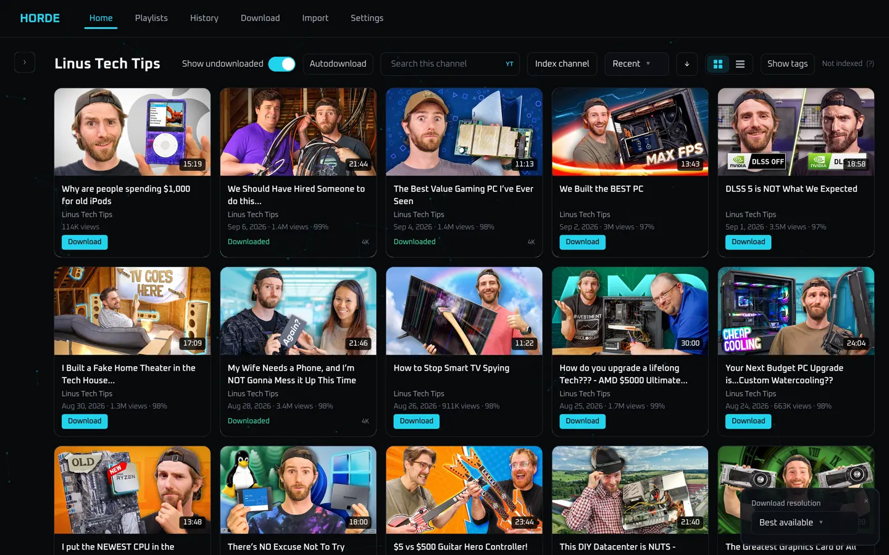
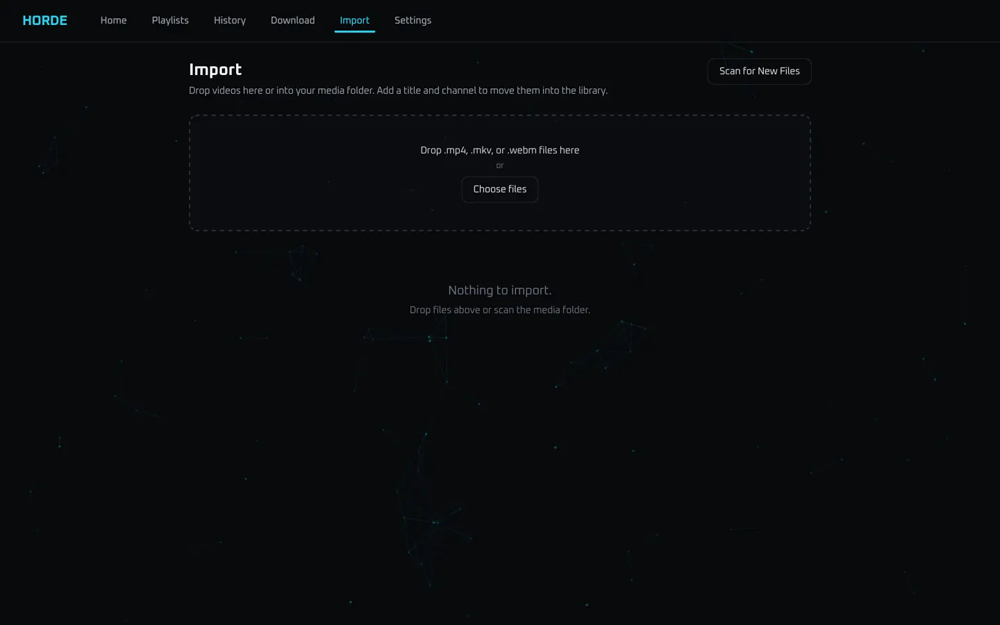
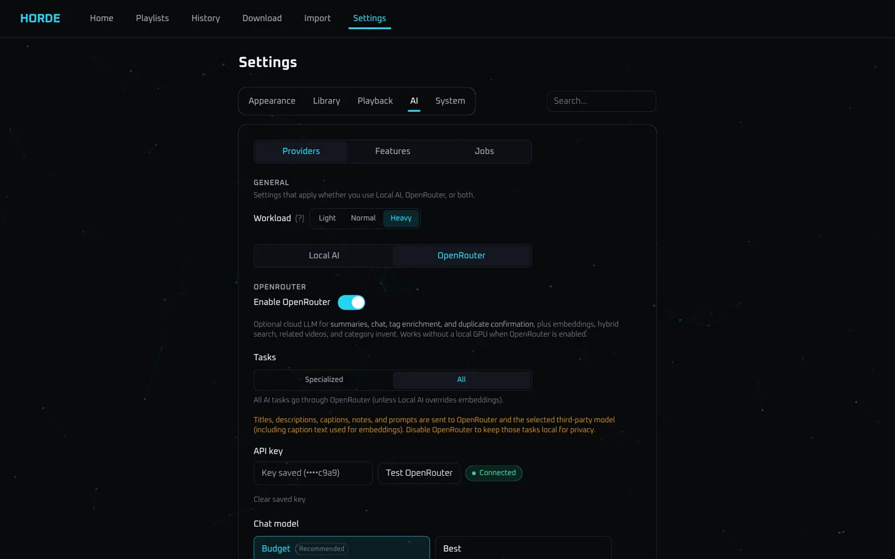

# Features

A closer look at what Horde actually does. Each section is a product tour, not a settings dump — follow the guide links when you need every control.

!!! warning "LAN only — no authentication"
    Single-admin, trusted LAN. Do not port-forward it.

## Downloads

Paste a [yt-dlp](https://github.com/yt-dlp/yt-dlp)-supported URL (YouTube is the well-tested path), pick a quality preset, and watch a FIFO queue with live progress. Pause and resume the queue. YouTube playlists can be imported as individual videos or turned into a Horde playlist.

Presets range from **best** (highest AV1 when YouTube offers it) through height caps (2160p down to 480p) and audio-only. After metadata loads, the UI can hide formats the source does not actually have. Horde does **not** download YouTube Shorts.

Files land as **one file per video**. Default archive codec is **AV1** (copied, remuxed to MP4 + AAC). Optional H.264/H.265 conversion after download is beta — there is still no Plex-style live transcode; playback is whatever the browser can decode.

Full guide: [Downloads](guides/downloads.md).

## On disk

Library identity is the relative media path:

`Channel/Year/Title [id].ext`

That tree is what you see over SMB, and it matches the UI. Sidecar thumbnails, subtitles, and sprites live beside the file. Dropped files on the share show up in Import within the scan interval (default 60s).

Why this layout: [Channel/year layout](design/channel-year-layout.md). Storage map: [Storage layout](ops/storage-layout.md).

## Library

The home screen is a video grid (or channel feed), a channel sidebar, search, tags, sorting, and bulk actions.

- **Channel sidebar** — filter by creator; search local channels and discover remote YouTube channels
- **Sort** — recently added, publish date, title, duration, size, views, or random (session override lasts 3 hours)
- **Tags** — chips from downloads, manual edits, or AI enrich
- **Select mode** — click, Shift-click ranges, then bulk add-to-playlist, notes, resync, download, or delete
- **Continue watching** — in-progress row on the home Library tab (7-day window)

Full guide: [Library](guides/library.md). Search behavior: [Search](guides/search.md).

## Channels and catalogs

Open a channel from the sidebar to see its **feed**: videos already in your library, plus optional **undownloaded** catalog entries from YouTube.

Catalogs are **YouTube-only**. You can browse, stream-preview, and queue downloads without leaving the feed. Sidebar search (≥ 2 characters) can also find remote channels you do not have yet. Non-YouTube yt-dlp URLs still download; they just do not get a remote catalog.

Full guide: [Channels](guides/channels.md).

## Import and review

Bring in files that did not come from the download queue: drag-and-drop on `/import`, or drop `.mp4` / `.mkv` / `.webm` into the media folder. A review queue asks for a **channel** (and usually a title) before the file joins the library.

**Scan for New Files** walks the tree immediately instead of waiting for the watchdog. Skip does not get undone by the background poller — only that button re-queues skipped files.

Full guide: [Import & review](guides/import-review.md).

## Player

Library watch and stream preview share the same player.

| Mode | Behavior |
|------|----------|
| **Standard** | Inline player in the watch layout |
| **Theater** | Wider player, reduced chrome (desktop) |
| **Windowed** | Immersive layout, page scroll locked (desktop) |

Also: mini player, PiP, Chromecast / AirPlay, SponsorBlock, chapters (description, yt-dlp, or optional AI), draggable VTT subtitles, hold-to-2×, and a session play queue. Mobile forces standard mode.

Keyboard shortcuts live in the [player guide](guides/player.md) and the [shortcuts reference](reference/keyboard-shortcuts.md). Watch/resume behavior: [Watching](guides/watching.md).

## Stream preview

You can play a remote YouTube URL in the same shell (`/watch?url=…`) to preview before committing disk. Adaptive DASH when available. This path is **somewhat fragile** and quality can vary from video to video. Streaming is not the primary focus — preview, then download. When a download started from preview **completes**, Horde hands off to the local file and keeps your place where it can.

## Playlists

Create your own lists, import a YouTube playlist in one shot, or **subscribe** so new parts append on a schedule (about hourly). Sync never deletes files. Add videos from the playlist page, from library bulk select, or from recent downloads.

Full guide: [Playlists](guides/playlists.md).

## Optional AI

Turn the archive into something you can actually ask questions of. Use **Ollama** on a GPU host, **OpenRouter** (often cheaper and lower maintenance for this app), or both.

| Feature | Needs |
|---------|--------|
| Hybrid search (keyword + embeddings) | Embed indexes |
| Related videos on Watch | Embeddings |
| Recommended home tab | Embeddings + categories |
| Summaries, chapters, chat, tag enrich | Chat LLM |
| Duplicate help on Import | Chat (optional embed similarity) |

Until providers are ready, Library stays on a single home tab and search is keyword-only. Workload profiles keep a small GPU from getting thrashed.

Setup: [AI setup](ops/ai-setup.md). What each feature does: [AI features](guides/ai-features.md). Local vs cloud: [Local vs cloud AI](design/local-vs-cloud-ai.md).

## One container

API, React UI, and this wiki ship in a single image. Host port **8686** maps to container **8080**. Full docs in a running instance: **Settings → System → Documentation**, or `/wiki/`. Interactive API: `/docs`.

Next: [Install with Docker](getting-started/install-docker.md) or [TrueNAS / Dockge](getting-started/truenas-dockge.md).
