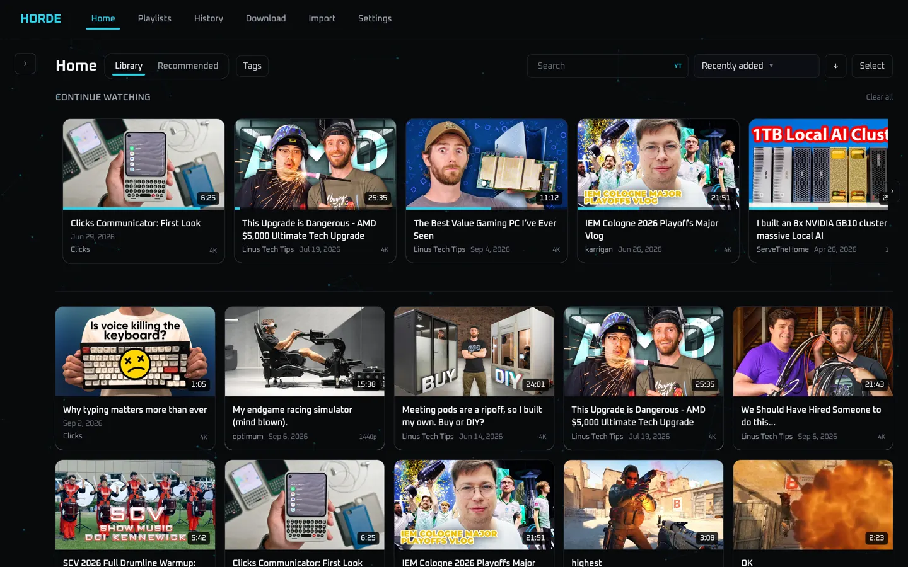

# Horde

Horde is a self-hosted media archive, downloader, and player for your homelab. Upload videos directly, or paste a YouTube (or other [yt-dlp](https://github.com/yt-dlp/yt-dlp)-supported) link, download it to your server with metadata and thumbnails, then browse and watch everything through a customizable web UI.

Direct YouTube playback is also supported, but somewhat fragile and resolution can vary. Horde is designed to be archive-first, with streaming as a secondary function.

Horde was built because of the features I believe Plex is missing. Plex is great for Movies and TV, but awkward for other videos — long-form YouTube, talks, music videos, random archives you want to keep forever. TubeArchivist and similar projects are solid; but Horde is the version shaped around my homelab setup: **TrueNAS with Dockge**, a single container, files on disk that still make sense over SMB, and an optional AI layer that is cheap to run.

Every video watched through Horde instead of YouTube avoids all YouTube pre-roll and mid-roll ads. Baked-in video sponsors can also be skipped with included support for [SponsorBlock](https://github.com/ajayyy/SponsorBlock).

There are several useful AI features that are fully optional. Horde can use either an Ollama instance or an OpenRouter API key. I prefer OpenRouter as it's fast, low maintenance, and for Horde's use, extremely cheap. Some AI features include summary generation, chat about a video (using metadata and subtitle files), enhanced search and recommendations, and generating tags.

I strongly recommend using Tailscale (or something similar) if you aren't already. This makes remote access and playback very straightforward, assuming your network has the upload bandwidth necessary.

The majority of this wiki beyond this point is AI-generated, but accurate. It provides a good overview of features and how-to's regarding Horde. If you have more advanced questions then I recommend you clone the repo, open in your IDE of choice, and ask your favorite model.

!!! warning "LAN only — no authentication"
    Horde is a single-admin app with **no login**. Keep it on a trusted LAN. Do not expose it to the public internet.

##  Feature highlights

See the [feature overview](features.md) for screenshots and detail. In short:

| Area              | What you get                                                                                   |
| ----------------- | ---------------------------------------------------------------------------------------------- |
| **Downloads**     | URL ingestion, quality presets, live FIFO queue, pause/resume, YouTube playlist import         |
| **On disk**       | `Channel/Year/Title [id].ext` so SMB browsing matches the UI                                   |
| **Library**       | Channel sidebar, tags, hybrid search, sorting, bulk select, continue watching                  |
| **Channels**      | YouTube catalogs: browse, preview, and download uploads you do not have yet                    |
| **Import**        | Drag-and-drop or drop files on the share; review before they join the library                  |
| **Player**        | Standard / theater / windowed, mini player, PiP, Chromecast, SponsorBlock, chapters, subtitles |
| **Playlists**     | Your own lists, imported YouTube playlists, or subscribed lists that pick up new parts         |
| **AI** (optional) | Ollama and/or OpenRouter for embeddings, tags, summaries, chat, recommendations, duplicates    |

Install starts with **cloning this git repo** onto the Docker host (Horde is built from source, not pulled as a Hub image). Then either `docker compose up --build` or Dockge **Scan** + **Deploy**.

[Install with Docker](getting-started/install-docker.md){ .md-button .md-button--primary } [TrueNAS / Dockge](getting-started/truenas-dockge.md){ .md-button }

Want a tour of the UI first? See the [feature overview](features.md).

## Where to start

1. [Install with Docker](getting-started/install-docker.md) — clone, `.env`, compose — or [TrueNAS / Dockge](getting-started/truenas-dockge.md) from a blank NAS
2. [First run](getting-started/first-run.md) — download something and browse it
3. [Updating](getting-started/updating.md) — `git pull` via `bash update.sh` on the host
4. [Settings](settings/index.md) — appearance, library, playback, AI
5. [AI setup](ops/ai-setup.md) — when you want recommendations and smarter search

## Map of this wiki

- **Features** — product tour with screenshots
- **Getting started** — clone, Docker / Dockge from zero, first run, update, local development, [automated testing](getting-started/testing.md)
- **Using Horde** — day-to-day guides for every major screen
- **Settings** — every control and what it does
- **Configuration & ops** — env vars, storage, YouTube bot checks, backups, troubleshooting
- **Architecture** — how the backend, frontend, workers, and AI pipeline fit together
- **Design decisions** — why things work the way they do
- **Reference** — shortcuts, glossary, FAQ

In a running Horde instance, open **Settings → System → Documentation** to reach this wiki at `/wiki/`. Interactive API docs live at `/docs` (Swagger). The same wiki is published at [jm-connell.github.io/horde](https://jm-connell.github.io/horde/).

If you want to change Horde, clone the repo, boot it with an AI-enabled IDE, and go. Questions: open this repo in Cursor and use Ask mode.

## License

Horde is source-available under the **PolyForm Noncommercial License 1.0.0**. Personal and other noncommercial use is allowed; selling Horde or using it commercially is not. The legal text is `LICENSE` at the repository root. See the [FAQ](reference/faq.md#what-license-is-horde-under).