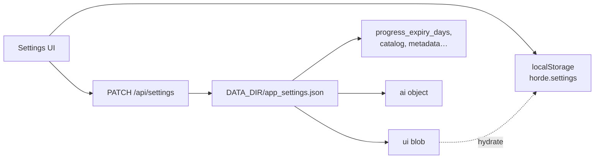

# Settings overview

Horde Settings (`/settings`) controls appearance, library behavior, playback, optional AI, and system health. Preferences use a **three-layer persistence** model so the UI feels instant on this browser while still following you across devices that share the same Horde server.

## Three-layer persistence

| Layer | Where | What lives there |
|-------|--------|------------------|
| **Browser** | `localStorage` key `horde.settings` | Full client `Settings` object (themes, playback prefs, AI panel state, and more). Applied immediately on every change. |
| **Server UI blob** | `app_settings.json` → `ui` | Keys listed in `SERVER_UI_KEYS`. Synced after local writes (~300 ms debounce) and hydrated on load when the blob is non-empty. |
| **Top-level app settings** | `app_settings.json` root + nested `ai` | Server-owned values such as `progress_expiry_days`, catalog limits, metadata interval, and the entire `ai` object. Edited via `/api/settings` (and the AI panes). |

### How sync works

1. **Boot** — Load `horde.settings` from localStorage and apply theme/fonts immediately.
2. **Hydrate** — One `GET /api/settings` for the whole app. If `ui` has keys, they overwrite matching local fields (plus `progress_expiry_days` → `progressExpiryDays`). If `ui` is empty, the client **migrates** local `SERVER_UI_KEYS` up to the server.
3. **Edits** — `useSettings` writes localStorage first, then schedules a patch of the `ui` blob. Top-level and AI fields use explicit save helpers (e.g. progress expiry, catalog caps, `saveAi`).

!!! tip "Same server, new browser"
    Opening Horde on another machine pulls the server `ui` blob and AI/app settings. Keys **not** in `SERVER_UI_KEYS` (notably `volume` and `lastCustomChannel`) stay per-browser.

See [All settings](all-settings.md) for every key, default, type, and storage layer.

## Tabs and deep links

| Tab | Path | Doc |
|-----|------|-----|
| Appearance | `?tab=appearance` | [appearance.md](appearance.md) |
| Library | `?tab=library` | [library.md](library.md) |
| Playback | `?tab=playback` | [playback.md](playback.md) |
| AI | `?tab=ai` | [ai.md](ai.md) |
| System | `?tab=system` | [system.md](system.md) |

### Query parameters

| Param | Values | Behavior |
|-------|--------|----------|
| `tab` | `appearance` \| `library` \| `playback` \| `ai` \| `system` | Opens that tab. Also stored in `localStorage` as `horde.settings.tab`. |
| `pane` | `providers` \| `features` \| `jobs` | AI sub-pane (meaningful when `tab=ai`). |

Examples:

- `/settings?tab=appearance`
- `/settings?tab=library`
- `/settings?tab=playback`
- `/settings?tab=ai&pane=providers`
- `/settings?tab=ai&pane=features`
- `/settings?tab=ai&pane=jobs`
- `/settings?tab=system`

!!! note "Legacy `downloads` tab"
    `?tab=downloads` and a stored tab value of `downloads` both resolve to **Library**. Download badge / loudness controls live under [Library → Downloads](library.md#downloads).

## Settings search

The search box at the top of Settings filters rows **across tabs** using a keyword registry (synonyms like “sponsor”, “vram”, “wiki”).

- Matching sections stay visible; non-matches hide.
- If the current tab has no hits, Horde jumps to the first tab (and AI pane) that matches.
- Clearing search restores the previous tab/pane context.

## Related pages

- [Appearance](appearance.md) — themes, fonts, backgrounds, chrome
- [Library](library.md) — continue watching, sorts, catalog, metadata
- [Playback](playback.md) — watch page, subtitles, SponsorBlock, speed
- [AI](ai.md) — providers, features, jobs
- [System](system.md) — updates, health, storage, docs links
- [All settings appendix](all-settings.md) — exhaustive key tables
- [Settings split (design)](../design/settings-split.md) — why client vs server
